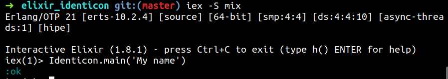

**Just an exercise. Do not use in production.**
Based on the code from this course https://www.udemy.com/the-complete-elixir-and-phoenix-bootcamp-and-tutorial/ by Stephen Grider.

# Identicon

Piece of code to generate an Identicon like the ones that replace user image on Github.

## Running

## Example
Images generated using different names:

### bruno

### luke

### leia

### han

### yoda

